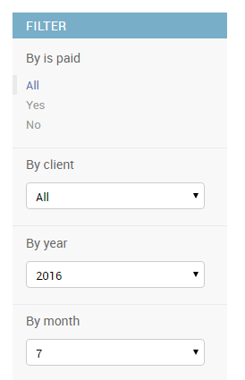

# django-admin-list-filter-dropdown

A Django admin filter implementation that renders as a dropdown.

If you have more than ten values for a field that you want to filter by in
Django admin, the filtering sidebar gets long, cluttered and hard to use.

This app contains the `DropdownFilter` class that renders as a drop-down in the
filtering sidebar to avoid this problem.

# Usage

Install:

```sh
pip install git+http://github.com/mrts/django-admin-list-filter-dropdown.git
```

Enable in `settings.py`:

```py
INSTALLED_APPS = (
    ...
    'django_admin_listfilter_dropdown',
    ...
)

```

Use in `admin.py`:

```py
from django_admin_listfilter_dropdown.filters import DropdownFilter, RelatedDropdownFilter

class EntityAdmin(admin.ModelAdmin):
    ...
    list_filter = (
        # for ordinary fields
        ('a_charfield', DropdownFilter),
        # for related fields
        ('a_foreignkey_field', RelatedDropdownFilter),
    )
```

# Example

Here's what it looks like:



# Credits

Based on [this StackOverflow question](http://stackoverflow.com/a/20900314/258772) and
[code from FeinCMS](https://github.com/feincms/feincms/blob/master/feincms/templates/admin/filter.html).
